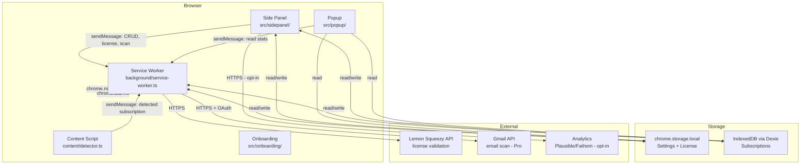

# Design Document: SubGuard Browser Extension

## Overview

SubGuard is a Manifest V3 browser extension built with Vite + React 18 + TypeScript. It provides a local-first subscription management dashboard with zero mandatory cloud dependency. All user data lives in `chrome.storage.local` (settings, license) and IndexedDB via Dexie.js (subscriptions). The only external network calls are: Lemon Squeezy license validation and user-initiated Gmail OAuth scanning (Pro).

The architecture is divided into four isolated execution contexts that communicate exclusively via `chrome.runtime.sendMessage` / `chrome.runtime.onMessage`:

1. **Service Worker** — event-driven background process (alarms, notifications, message routing)
2. **Content Script** — injected into known service domains for subscription detection
3. **Side Panel** — primary React SPA (dashboard, calendar, settings, forms)
4. **Popup** — compact React summary view

---

## Architecture



### Key Architectural Decisions

- **Local-first**: All reads/writes go to local storage. No sync server.
- **Service Worker is stateless**: MV3 service workers are terminated after ~30s of inactivity. No global mutable state. All state is read from storage on each wake.
- **Message Bus pattern**: UI contexts never call external APIs directly. They send typed messages to the Service Worker, which owns all network I/O.
- **Dexie for subscriptions**: IndexedDB handles large datasets and supports transactions. `chrome.storage.local` is reserved for small, frequently-read data (settings, license).
- **React error boundaries**: Every major UI section is wrapped in an error boundary to prevent blank screens.

---

## Components and Interfaces

### Message Bus (`src/shared/messageBus.ts`)

All inter-context communication uses a typed message protocol:

```typescript
type MessageType =
  | 'SUBSCRIPTION_DETECTED'
  | 'VALIDATE_LICENSE'
  | 'START_EMAIL_SCAN'
  | 'CANCEL_EMAIL_SCAN'
  | 'GET_STATS'
  | 'SCHEDULE_ALARM'
  | 'CANCEL_ALARM'
  | 'REVALIDATE_LICENSE';

interface Message<T extends MessageType, P = unknown> {
  type: T;
  payload: P;
}

interface MessageResponse<T = unknown> {
  success: boolean;
  data?: T;
  error?: string;
}
```

### Storage Layer (`src/shared/storage.ts`)

Wraps `chrome.storage.local` with typed getters/setters and a fallback to defaults on read failure:

```typescript
async function getSettings(): Promise<UserSettings>
async function setSettings(partial: Partial<UserSettings>): Promise<void>
async function getLicense(): Promise<LicenseInfo | null>
async function setLicense(license: LicenseInfo | null): Promise<void>
```

On any `chrome.storage.local` read failure, the function returns the default value and logs a warning (satisfies Req 16.7).

### Database Layer (`src/shared/db.ts`)

```typescript
class SubGuardDB extends Dexie {
  subscriptions!: Table<Subscription, string>;

  constructor() {
    super('SubGuardDB');
    // Version history must be kept in full for users upgrading from any prior version
    this.version(1).stores({
      subscriptions: 'id, service, status, renewalDate, category, createdAt'
    });
    // Future versions add .upgrade() callbacks here
  }
}
```

**Migration strategy**: Each new schema version declares `.stores()` changes and an `.upgrade(tx => ...)` callback. Dexie handles the `onupgradeneeded` event. On migration failure, the error is caught, logged, and surfaced to the user (Req 16.5). The current schema version is exported as a constant for the startup integrity check (Req 16.6).

### License Service (`src/shared/licenseService.ts`)

```typescript
interface LicenseValidationResult {
  isValid: boolean;
  license?: LicenseInfo;
  error?: string;
}

async function validateLicense(key: string): Promise<LicenseValidationResult>
async function revalidateStoredLicense(): Promise<void>
```

- Implements exponential backoff (3 retries, delays: 1s, 2s, 4s) for 5xx/network errors (Req 9.6)
- Rate-limits to 5 attempts/hour using a counter stored in `chrome.storage.local` (Req 9.8)
- On API unavailability during periodic re-validation, preserves Pro status for up to 7 days (Req 9.7)
- Periodic re-validation is triggered by a daily `chrome.alarms` entry named `license-revalidation`

### Service Worker (`src/background/service-worker.ts`)

Responsibilities on each wake event:

| Event | Action |
|-------|--------|
| `chrome.runtime.onInstalled` (install) | Register all renewal alarms, open onboarding |
| `chrome.runtime.onInstalled` (update) | Re-register all renewal alarms, run DB migrations |
| `chrome.alarms.onAlarm` (renewal) | Send renewal notification |
| `chrome.alarms.onAlarm` (license-revalidation) | Call `revalidateStoredLicense()` |
| `chrome.runtime.onMessage` (SUBSCRIPTION_DETECTED) | Dedup check, prompt user |
| `chrome.runtime.onMessage` (VALIDATE_LICENSE) | Call `validateLicense()`, return result |
| `chrome.runtime.onMessage` (START_EMAIL_SCAN) | Initiate Gmail OAuth + scan |
| `chrome.notifications.onClicked` | Open Side Panel, navigate to subscription |

**Statelessness**: The Service Worker reads all needed state from storage at the start of each handler. No module-level mutable variables are used.

### Content Script (`src/content/detector.ts`)

```typescript
// Runs at document_idle on known service domains only
const DETECTION_PATTERNS = {
  amount: /\$[\d,]+\.?\d{0,2}|\d+\.?\d{0,2}\s*(USD|EUR|GBP)/i,
  date: /(?:next billing|renews on|renewal date)[:\s]+([A-Za-z]+ \d{1,2},?\s*\d{4}|\d{1,2}\/\d{1,2}\/\d{4})/i,
  cycle: /monthly|annually|yearly|weekly|quarterly/i,
};
```

- Checks `window.location.hostname` against the Service Catalog domain list before running
- Uses a session-level `Set<string>` to track dismissed detections (Req 6.6)
- Exits within 100ms; uses `requestIdleCallback` if available (Req 19.5)
- Wraps all DOM access in try/catch; logs errors and exits cleanly (Req 6.7)


---

## Data Models

### Subscription

```typescript
interface Subscription {
  id: string;                    // uuid v4
  service: string;               // catalog key or custom name
  customName?: string;
  cost: number;                  // stored in original currency
  currency: Currency;            // original currency
  billingCycle: BillingCycle;
  renewalDate: string;           // ISO 8601 date string
  status: SubscriptionStatus;
  category: Category;
  website?: string;
  logoKey?: string;              // matches filename in public/service-logos/
  notes?: string;
  detectedFrom?: string;         // source domain if auto-detected
  lastUsed?: string;             // ISO 8601 date string
  cancelUrl?: string;
  resumeDate?: string;           // ISO 8601 date; for paused subscriptions
  createdAt: string;             // ISO 8601
  updatedAt: string;             // ISO 8601
}

type BillingCycle = 'monthly' | 'yearly' | 'weekly' | 'quarterly' | 'lifetime';
type SubscriptionStatus = 'active' | 'cancelled' | 'paused' | 'trial';
type Category = 'streaming' | 'saas' | 'fitness' | 'food' | 'music' | 'cloud' | 'ai' | 'education' | 'other';
type Currency = 'USD' | 'EUR' | 'GBP' | 'PKR' | 'INR' | 'CAD' | 'AUD';
```

### UserSettings

```typescript
interface UserSettings {
  theme: 'light' | 'dark';
  currency: Currency;
  reminderDaysBefore: number;    // 1–30, default 3
  notificationsEnabled: boolean;
  autoDetectEnabled: boolean;
  emailScanEnabled: boolean;     // Pro only
  analyticsOptIn: boolean;       // default false
  proLicense: boolean;
  onboardingComplete: boolean;
  firstRunAt: string;            // ISO 8601
}
```

### LicenseInfo

```typescript
interface LicenseInfo {
  key: string;
  type: 'monthly' | 'lifetime';
  validatedAt: string;           // ISO 8601
  expiresAt?: string;            // ISO 8601; null for lifetime
  email: string;
  isValid: boolean;
  lastRevalidationAttempt?: string; // ISO 8601
  gracePeriodStart?: string;     // ISO 8601; set when API is unreachable
}
```

### SpendStats

```typescript
interface SpendStats {
  monthlyTotal: number;          // in display currency
  annualProjection: number;      // in display currency
  activeCount: number;
  cancelledCount: number;
  trialCount: number;
  pausedCount: number;
  upcomingRenewals: UpcomingRenewal[];
  byCategory: Record<Category, number>;
  currency: Currency;
  isApproximate: boolean;        // true when multi-currency conversion applied
}

interface UpcomingRenewal {
  subscriptionId: string;
  service: string;
  renewalDate: string;
  cost: number;
  currency: Currency;
  convertedCost: number;         // in display currency
  isTrial: boolean;
}
```

### ServiceCatalogEntry

```typescript
interface ServiceCatalogEntry {
  key: string;                   // unique identifier, matches logoKey
  name: string;
  domains: string[];             // for content script matching
  defaultCategory: Category;
  defaultCancelUrl: string;
  logoFile: string;              // filename in public/service-logos/
}
```

### Exchange Rates

```typescript
// src/shared/constants.ts — updated at build time
const EXCHANGE_RATES_USD_BASE: Record<Currency, number> = {
  USD: 1.0,
  EUR: 0.92,
  GBP: 0.79,
  PKR: 278.5,
  INR: 83.1,
  CAD: 1.36,
  AUD: 1.53,
};
const EXCHANGE_RATES_UPDATED_AT = '2025-01-01'; // updated each release
```

---

## Correctness Properties

*A property is a characteristic or behavior that should hold true across all valid executions of a system — essentially, a formal statement about what the system should do. Properties serve as the bridge between human-readable specifications and machine-verifiable correctness guarantees.*

### Property 1: Subscription CRUD round-trip

*For any* valid `Subscription` object, writing it to IndexedDB and then reading it back by ID should produce an object equal to the original.

**Validates: Requirements 1.3, 1.5, 16.2**

---

### Property 2: SpendStats monthly total consistency

*For any* collection of active subscriptions, the computed `monthlyTotal` in SpendStats should equal the sum of each subscription's cost normalized to a monthly figure in the display currency.

**Validates: Requirements 2.1, 2.2, 25.3**

---

### Property 3: Paused subscriptions excluded from spend

*For any* collection of subscriptions where one or more have status `paused`, the `monthlyTotal` should equal the total computed using only `active` and `trial` subscriptions.

**Validates: Requirements 24.2, 2.1**

---

### Property 4: Alarm registration invariant

*For any* set of active subscriptions with future renewal dates, after calling the alarm registration function, every subscription should have a corresponding `chrome.alarms` entry with a scheduled time matching its reminder offset.

**Validates: Requirements 5.1, 5.4, 18.1**

---

### Property 5: Duplicate detection correctness

*For any* existing subscription list and any new subscription candidate, the duplicate detection function should return `true` if and only if there exists a subscription in the list with the same service name and renewal date.

**Validates: Requirements 1.8**

---

### Property 6: CSV export/import round-trip

*For any* collection of subscriptions, exporting to CSV and then importing the resulting CSV should produce a collection of subscriptions with equivalent field values (excluding `id`, `createdAt`, `updatedAt`).

**Validates: Requirements 10.1, 10.4**

---

### Property 7: Currency conversion consistency

*For any* subscription cost in any supported currency, converting to the display currency and back to the original currency should produce a value within 0.01 of the original (floating-point tolerance).

**Validates: Requirements 25.2, 25.3**

---

### Property 8: License rate-limit enforcement

*For any* sequence of license validation attempts, the rate limiter should reject any attempt that would exceed 5 validations within a 60-minute sliding window.

**Validates: Requirements 9.8**

---

### Property 9: Whitespace subscription names rejected

*For any* string composed entirely of whitespace characters, attempting to create a subscription with that string as the service name should be rejected with a validation error.

**Validates: Requirements 1.4**

---

### Property 10: Cancelled subscription alarm cleanup

*For any* subscription that transitions to `cancelled` or `paused` status, after the status update is persisted, no `chrome.alarms` entry should exist for that subscription's ID.

**Validates: Requirements 5.5, 24.2**

---

### Property 11: Search filter correctness

*For any* search query string and subscription list, every subscription returned by the search filter should contain the query string (case-insensitive) in at least one of: service name, custom name, or notes.

**Validates: Requirements 13.2**

---

### Property 12: Settings persistence round-trip

*For any* `UserSettings` object, writing it to `chrome.storage.local` and reading it back should produce an object equal to the original.

**Validates: Requirements 11.6**

---

## Error Handling

### Storage Errors

- **IndexedDB write failure**: Caught at the Dexie transaction level. UI receives an error response via the message bus. A toast with a retry button is displayed. The failed write is not silently dropped.
- **`chrome.storage.local` read failure**: Returns default values. A non-blocking warning toast is shown. The extension remains functional.
- **Schema migration failure**: The error is caught in the Dexie `upgrade()` callback. The pre-migration data is preserved. The user is notified via a persistent error banner.

### Network Errors

- **License validation — 4xx**: Non-retryable. Display specific error (invalid key, expired, etc.). Do not activate Pro.
- **License validation — 5xx / timeout**: Retry up to 3 times with exponential backoff (1s, 2s, 4s). After exhausting retries, show connectivity error.
- **License re-validation — API unreachable**: Start grace period timer. Preserve Pro status for up to 7 days. Show a subtle warning badge.
- **Gmail API — rate limit (429)**: Display user-friendly message. Schedule retry no sooner than 1 hour later.
- **Gmail API — OAuth denied**: Display error. Do not retry. Do not persist any token.

### UI Errors

- **React rendering error**: Caught by error boundary. Display a "Something went wrong" card with a reload button. The rest of the UI remains functional.
- **Content Script DOM error**: Caught in try/catch. Logged to console. Page functionality unaffected.
- **Service Worker terminated mid-operation**: MV3 service workers can be killed at any time. All operations are designed to be idempotent — re-running them on the next wake produces the same result.

### Notification Permission Errors

- **Permission denied**: `notificationsEnabled` set to `false`. Toggle disabled in Settings. Explanatory message shown.
- **Permission revoked externally**: Detected on next startup via `chrome.notifications.getPermissionLevel()`. Settings updated accordingly.

---

## Testing Strategy

### Dual Testing Approach

SubGuard uses both unit tests and property-based tests. They are complementary:

- **Unit tests** cover specific examples, edge cases, and integration points (e.g., "adding Netflix with $15.99/month produces the correct monthly total").
- **Property-based tests** verify universal correctness across all valid inputs (e.g., "for any subscription, the CSV round-trip preserves all fields").

### Property-Based Testing Library

**[fast-check](https://github.com/dubzzz/fast-check)** — TypeScript-native, works with Vitest, supports custom arbitraries for domain types.

Each property test runs a minimum of **100 iterations** (configured via `fc.configureGlobal({ numRuns: 100 })`).

Each property test is tagged with a comment referencing the design property:
```typescript
// Feature: subguard, Property 1: Subscription CRUD round-trip
```

### Test Configuration

```typescript
// vitest.config.ts
export default defineConfig({
  test: {
    environment: 'jsdom',
    globals: true,
    setupFiles: ['./src/test/setup.ts'],
  }
});
```

Chrome extension APIs (`chrome.*`) are mocked via `jest-chrome` or a manual mock in `src/test/setup.ts`.

### Unit Test Focus Areas

- Subscription form validation (required fields, type coercion, date parsing)
- SpendStats computation (billing cycle normalization, currency conversion)
- Duplicate detection logic
- CSV parser and serializer
- Service Catalog autocomplete matching
- Alarm scheduling logic (correct offset calculation)
- License rate limiter
- Error boundary rendering

### Property Test Focus Areas

Each of the 12 Correctness Properties above maps to exactly one property-based test. Arbitraries are defined for:
- `fc.record(...)` for `Subscription` with valid field ranges
- `fc.constantFrom(...)` for enum types (`Currency`, `BillingCycle`, etc.)
- `fc.string()` filtered for whitespace-only inputs (Property 9)
- `fc.array(subscriptionArbitrary)` for collection properties

### Integration Test Focus Areas

- Service Worker message handling (mocked `chrome.alarms`, `chrome.notifications`)
- Dexie migration path (in-memory IndexedDB via `fake-indexeddb`)
- License validation with mocked fetch responses
- End-to-end subscription add → alarm registration → notification flow

### Build-Time Validation

- `tsc --noEmit` — zero type errors required
- Bundle size check — must be under 5MB
- Cancel URL reachability check — HTTP HEAD requests to all 40 URLs
- Logo file existence check — verify all 40 PNG files present
